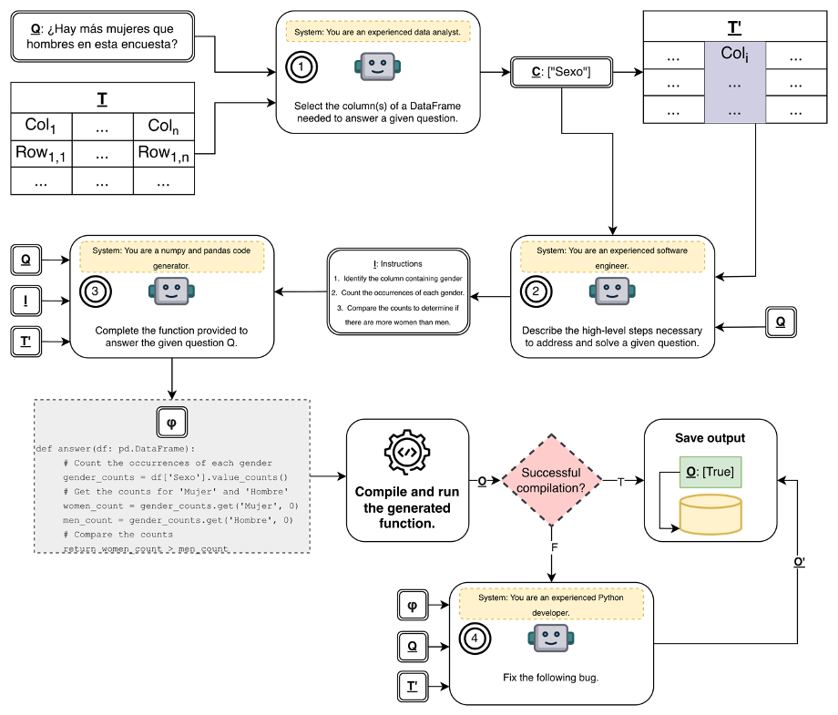

# MAQAPiTA: Multi-Agent Question-Answering Pipeline for TAbular Data

**MAQAPiTA** is a **personal research project** focused on exploring the use of **small LLMs** to answer questions over **tabular data**.  
The dataset used for experimentation comes from the competition **PRESTA: Preguntas y Respuestas sobre Tablas en Español**, available at:  
https://www.codabench.org/competitions/5538/

The core idea behind this project is the design of a **multi-agent pipeline** combined with a **program-aided approach**, where the LLMs not only generate reasoning steps but also produce executable Python code that is dynamically evaluated.

---

## 🧩 Pipeline Overview

The proposed pipeline uses **four agents**, each responsible for a specific stage of the reasoning and code-generation process.  
Below is the figure of the pipeline (located at `img/MAQAPiTA.png`):



### 🔹 **Agent 1 — Column Selector**
Given a question **Qi**, this agent selects the **relevant table columns** needed to answer it.

### 🔹 **Agent 2 — High-Level Planner**
This agent produces the **sequence of reasoning steps** (a high-level algorithm) required to answer **Qi** based on the selected columns.

### 🔹 **Agent 3 — Code Generator**
Using the outputs of Agents 1 and 2, this agent generates **Python code** to answer **Qi**.  
It assumes the table is a **Pandas DataFrame** and must complete a function that returns the correct result.

### 🔹 **Agent 4 — Code Debugger**
If the generated code fails to compile, this agent attempts to **repair the code**.  
The system allows up to **k correction iterations**.  
If the code cannot be fixed, an **error** is recorded as the final answer for **Qi**.

---

## 🧪 Baseline Approach

As a comparison, a **simpler baseline** is included.  
The baseline consists of a **single prompt** directing the LLM to complete a Python function that answers question **Qi**, without using multiple agents or intermediate planning steps.

---

## 📁 Project Structure

```
MAQAPiTA/
│
├── img/
│ └── MAQAPiTA.png # Figure of the proposed multi-agent pipeline
│
├── notebooks/
│ └── *.ipynb # Notebooks used for debugging and development
│
├── output_results/
│ └── *.txt # Output answers from both the pipeline and the baseline
│ # (each line corresponds to the answer for a question)
│
├── test_data/
│ └── *.csv # Test dataset from the PRESTA competition
│
├── utilities/
│ ├── Generator.py # Module to execute and manage LLM outputs
│ ├── promptGenerator.py # Dynamically generates prompts for all agents and baseline
│ └── examples.txt # Few-shot examples for prompt construction
│
├── maqapita.py # Main entry point to run the multi-agent pipeline
└── baseline.py # Baseline method using a single LLM prompt
```

---

## ⚙️ Supported Models

Both the **pipeline** and the **baseline** currently support the following LLM families:

- **Llama 3**
- **Gemma 3**

---

## 🚀 How to Run

### 🔧 Run the Multi-Agent Pipeline
```bash
python3 maqapita.py --model meta-llama/Meta-Llama-3.1-8B-Instruct
```

### 🔧 Run the Baseline Approach
```bash
python3 baseline.py --model google/gemma-3-4b-it
```
---

## 📌 Final Notes

This project explores the feasibility of using **small open-source LLMs** combined with **multi-agent** reasoning and **program-aided execution** to answer questions over tabular data.
It is still under active development, and future updates may include expanded model support and improved debugging strategies.

If you find this project useful or interesting, feel free to ⭐ star the repository!